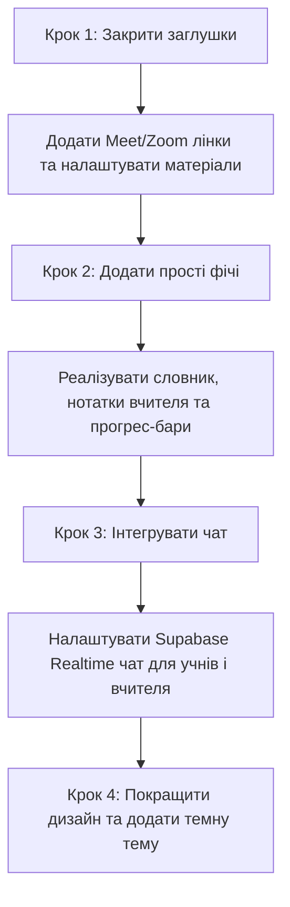

# Аналіз розділення кабінетів та нових функцій для платформи NovaFlow

Цей аналіз присвячений оцінці поточної структури сайту **NovaFlow**, пропозиціям вашого викладача щодо розділення особистих кабінетів учня та вчителя, а також класифікації складності й вартості реалізації кожної з фіч.

---

## 1. Що в поточному сайті вже добре, а що ні?

### 🟢 Що зроблено добре:
1. **Базовий поділ кабінетів вже є**: У коді чітко розмежовано кабінет викладача (`/teacher`) та учня (`/dashboard`). Авторизація через Supabase перевіряє роль (`role === 'teacher'` або `role === 'student'`) і перенаправляє на відповідну сторінку.
2. **Календар та планування**: Бібліотека `@fullcalendar` інтегрована в обидва кабінети. Викладач може створювати заняття, клікаючи на часову сітку, а також проводити чи скасовувати їх із автоматичним списанням балансу уроків у базі даних.
3. **Графічний інструмент перевірки домашніх завдань (Canvas)**: Реалізовано надзвичайно круту фічу (`TeacherReviewCanvas.tsx`), яка дозволяє малювати прямо на зображенні домашнього завдання учня (наприклад, червоним маркером виправляти помилки) та зберігати результат.
4. **Платіжна система**: Інтегрована робоча платіжка (WayForPay), яка автоматично зараховує придбані уроки на баланс учня.
5. **Адаптивність**: Інтерфейси мають мобільне меню та оптимізовані для роботи зі смартфонів (наприклад, календар автоматично перемикається на одноденний вид на мобільних пристроях).

### 🔴 Що потребує покращення (Недоліки):
1. **Сторінки-заглушки (Placeholders)**: Розділи "Матеріали" та "Мої уроки" в кабінеті учня наразі є просто статичним текстом без реального функціоналу.
2. **Відсутність комунікації**: Розділу чату (`💬 Повідомлення`) взагалі немає. Замість цього є коментарі/відгуки, але це не реальний чат для швидкого спілкування.
3. **Спрощений прогрес учня**: Наразі прогрес учня — це фіксоване число (72% для тих, у кого є уроки, і 0% для пробного періоду). Немає реального зв'язку з виконаними темами чи окремими навичками (Grammar, Speaking тощо).
4. **Обмежені налаштування**: Немає керування робочими годинами викладача або часовими поясами учня.

---

## 2. Класифікація пропозицій викладача

Нижче наведено розподіл усіх запропонованих змін за категоріями складності, вартості та пріоритетності.

### 1️⃣ Що ВЖЕ Є у системі (або майже реалізовано):
* **Особисті кабінети викладача та учня**: Повністю розділені на рівні ролей та сторінок.
* **Картки статистики викладача**: На головній є «Активні учні», «Занять цього тижня», «Наступний урок» (з відліком часу).
* **Мої учні**: Список учнів з картами та переходами у робочий простір.
* **Розклад (Календар)**: Інтегрований FullCalendar для планування майбутніх, перегляду минулих та скасування занять.
* **Домашні завдання**: Викладач може створювати завдання, прикріплювати файл. Учень бачить ДЗ, дедлайн, завантажує файл-відповідь. Викладач має Canvas для перевірки.

---

### 2️⃣ Що треба обов'язково додати (Пріоритет №1):
* **Кнопка «Почати урок / Приєднатися» (Google Meet)**:
  * *Складність*: Дуже легко.
  * *Як реалізувати*: Додати в таблицю `lessons` поле `meeting_link`. При плануванні уроку викладач може вказувати посилання на Google Meet/Zoom, або система може автоматично підставляти постійне посилання викладача.
* **Реальний розділ матеріалів (без папок на першому етапі)**:
  * *Складність*: Легко.
  * *Як реалізувати*: Використати Supabase Storage (де вже налаштовані бакети для файлів) та додати просту таблицю в БД для збереження посилань на файли (PDF, презентації, аудіо).

---

### 3️⃣ Що легко і БЕЗКОШТОВНО зробити (Пріоритет №2):
* **Особистий блокнот викладача (Нотатки)**:
  * *Як реалізувати*: Створити таблицю `teacher_notes` (student_id, teacher_id, content) в Supabase. У кабінеті викладача вивести просте текстове поле для швидкого збереження думок про учня.
* **Словник для учня (Dictionary)**:
  * *Як реалізувати*: Таблиця `student_vocabulary` (student_id, word, translation, example, is_learned). На сторінці учня додати інтерфейс картки для перегляду та кнопку «Додати слово».
* **Цілі та досягнення учня**:
  * *Як реалізувати*: Додати поле `goals` (масив рядків або JSON) у профіль учня. Ачівочки можна вираховувати автоматично на основі кількості виконаних занять у базі даних (наприклад, `lessons_completed_count >= 10` -> ачівка "10 занять").
* **Темна тема**:
  * *Як реалізувати*: Використати бібліотеку `next-themes` для перемикання класів у Tailwind CSS.
* **Кольори статусів уроків у календарі**:
  * *Як реалізувати*: Додати поле `status` ('scheduled', 'completed', 'moved', 'cancelled') у таблицю `lessons` та відповідно до статусу фарбувати подію в календарі в потрібний колір (зелений, синій, жовтий, червоний).

---

### 4️⃣ Що РЕАЛЬНО, але потребує часу та середніх зусиль:
* **Чат (💬 Повідомлення)**:
  * *Складність*: Середня.
  * *Як реалізувати*: Оскільки ви використовуєте Supabase, чат можна зробити на базі Supabase Realtime (миттєве отримання повідомлень без оновлення сторінки). Це безкоштовно, але потребує розробки інтерфейсу діалогів та збереження історії повідомлень у таблиці `messages`.
* **Красивий прогрес-бар навичок (Grammar, Speaking тощо)**:
  * *Складність*: Середня.
  * *Як реалізувати*: Потрібно створити таблицю оцінок навичок для кожного учня. Викладач у своєму кабінеті виставляє бали від 1 до 100 для Grammar, Speaking, Listening тощо, а учень бачить це у вигляді красивих кругових діаграм чи прогрес-барів.
* **Сертифікати про завершення рівня**:
  * *Складність*: Середня.
  * *Як реалізувати*: Коли прогрес досягає 100%, активується кнопка «Завантажити сертифікат». Генерація PDF відбувається прямо в браузері клієнта за допомогою JS-бібліотек (наприклад, `html2canvas` та `jspdf`), що є абсолютно безкоштовним.

---

### 5️⃣ Що ПЛАТНО або ДУЖЕ СКЛАДНО (Краще відкласти):
* **🤖 AI-помічник (генерація вправ, перевірка ДЗ)**:
  * *Чому складно/платно*: Потрібно інтегрувати API (OpenAI GPT-4o або Google Gemini Pro). Сама інтеграція займає кілька днів, але **запити до AI є платними**. За кожен запит учня чи вчителя ви будете платити реальні гроші зі своєї картки. Якщо учнів буде багато, це може стати значною статтею витрат.
* **📹 Запис уроків**:
  * *Чому складно/платно*: Зберігання гігабайтів відеофайлів потребує багато місця на серверах. Якщо ви використовуєте стандартний Google Meet або Zoom, запис доступний лише на їх платних бізнес-тарифах.
  * *Альтернатива*: Замість автоматичного запису, викладач може самостійно записувати урок на комп'ютер, завантажувати на свій Google Drive/YouTube (за приватним посиланням) та просто додавати лінк у матеріали конкретного уроку.
* **Двофакторна автентифікація (2FA)**:
  * *Чому складно/платно*: Supabase підтримує TOTP (через додатки на кшталт Google Authenticator) безкоштовно. Але якщо ви захочете надсилати коди через SMS або месенджери, доведеться платити за кожну SMS через сервіси на кшталт Twilio. Також це ускладнить користування платформою для нетехнічних користувачів.
* **Автоматичні SMS-нагадування про уроки**:
  * *Чому платно*: Відправка SMS завжди коштує грошей.
  * *Альтернатива*: Можна налаштувати безкоштовні email-сповіщення (наприклад, через сервіс Resend, який дає 3000 безкоштовних листів на місяць) або створити безкоштовного Telegram-бота для сповіщень.

---

### 6️⃣ Що НЕ ТРЕБА (Зайві функції на старті):
* **Детальна фінансова аналітика за рік із графіками**: На перших етапах роботи платформи це надлишкова інформація. Достатньо бачити простий список транзакцій від WayForPay.
* **Складна система папок у матеріалах**: Замість створення цілої файлової системи (як Google Drive) краще зробити просту фільтрацію за категоріями (Grammar, Vocabulary, Games тощо), які запропонував викладач. Це набагато простіше в розробці та зручніше для користувача.

---

## 3. Рекомендований план дій

Для того, щоб перетворити NovaFlow на професійну платформу без зайвих витрат, рекомендуємо рухатися за такими кроками:

1. **Крок 1: Заповнити основні прогалини** — замінити статичні тексти на сторінках матеріалів та уроків реальними даними з БД, додати посилання на Google Meet у розклад уроків.
2. **Крок 2: Додати словник та нотатки** — це прості функції, які значно підвищать цінність платформи для щоденного використання і не потребують фінансових витрат.
3. **Крок 3: Створити чат** — реалізувати обмін повідомленнями безпосередньо всередині платформи, щоб відмовитись від сторонніх месенджерів.
4. **Крок 4: Дизайн та статистика** — покращити візуальне відображення прогресу учнів (навичок) та додати темну тему.
